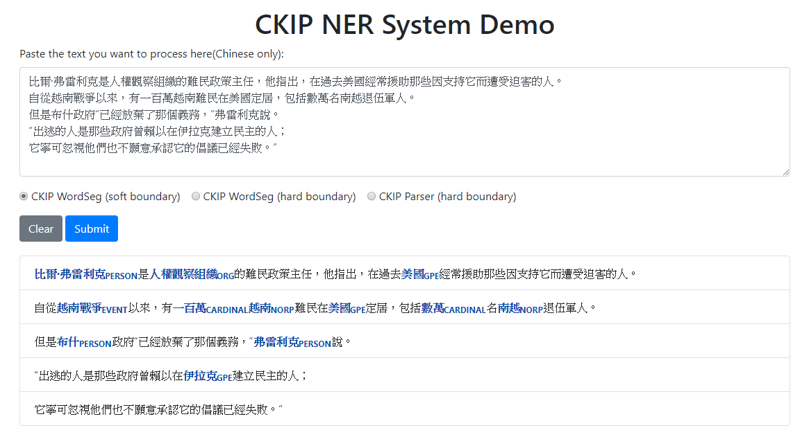
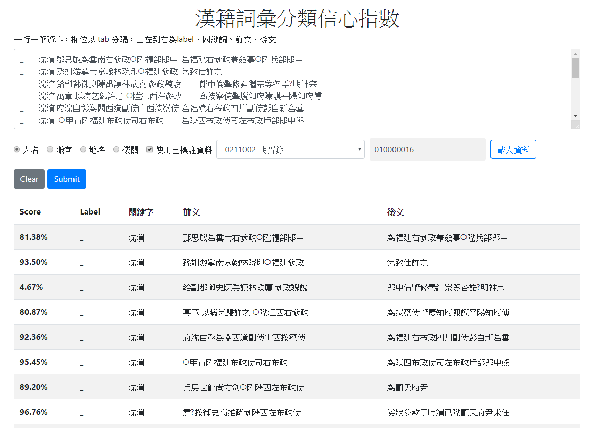
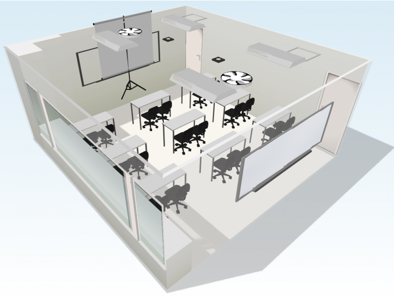
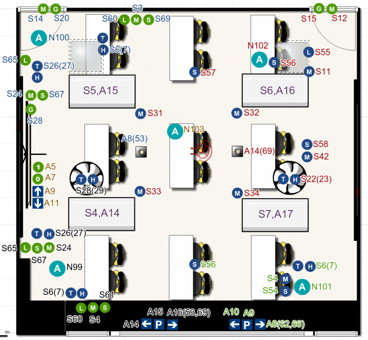

 Peng-Hsuan Li 李朋軒 [[CV]](doc/Curriculum_Vitae.pdf)

## Bio
Peng-Hsuan Li is currently a research assistant at <a href="https://www.iis.sinica.edu.tw/index_en.html">Institute of Information Science, Academia Sinica</a>, advised by <a href="http://www.iis.sinica.edu.tw/pages/ma/">Dr. Wei-Yun Ma</a> at the <a href="http://ckip.iis.sinica.edu.tw:8080/">Chinese Knowledge and Information Processing Lab (CKIP)</a>. His research interest is in computational linguistics.

Previously, Peng-Hsuan received his M.Sc. and B.Sc. degree at <a href="https://www.csie.ntu.edu.tw/main.php">Department of Computer Science & Information Engineering, National Taiwan University</a>, advised by <a href="https://iagentntu.github.io/professor/Jane">Prof. Jane Yung-Jen Hsu</a> at the <a href="https://iagentntu.github.io/">Intelligent Agents Lab (iAgents)</a>. He did research in human activity recognition.

Peng-Hsuan has 3 year working experiences in security industry. He also has experiences in college teaching and 3 year high school after-class teaching.

Please see his [CV](doc/Curriculum_Vitae.pdf) for more details about his education, experience, publication, award, and teaching.

## Project

* [CKIP Chinese NER.](http://deep.iis.sinica.edu.tw:9001/) 
Peng-Hsuan Li, Douglas Wu, and Wei-Yun Ma. 
 
 
 

* [CKIP Ancient Chinese Document NER.](http://sky.iis.sinica.edu.tw:9003/) 
Peng-Hsuan Li, Douglas Wu, and Wei-Yun Ma. 
 
 
 

* [Classroom Population Recognition without Lens.](doc/classroom_population_recognition.pdf) 
Yao-Hua Yang, Peng-Hsuan Li, Shih-Han Wang, and Jane Yung-Jen Hsu. 2015. 
*Undergraduate Project Exhibition, Department of Computer Science & Information Engineering, National Taiwan University*. 
 

 
 
