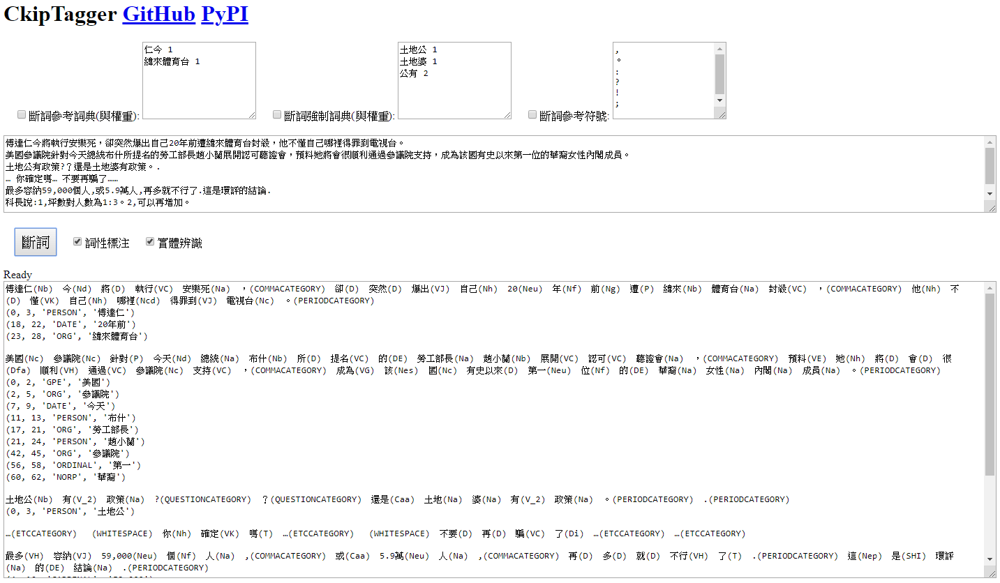

 Peng-Hsuan Li 李朋軒 [[CV]](doc/Curriculum_Vitae.pdf)

## Bio
Peng-Hsuan Li is currently a research assistant at the [Institute of Information Science, Academia Sinica](https://www.iis.sinica.edu.tw/index_en.html), advised by [Dr. Wei-Yun Ma](http://www.iis.sinica.edu.tw/pages/ma) at the [Chinese Knowledge and Information Processing Lab (CKIP)](http://ckip.iis.sinica.edu.tw). His research interest is in natural language processing and computational linguistics.

Previously, Peng-Hsuan received his M.Sc. and B.Sc. degree at [Department of Computer Science & Information Engineering, National Taiwan University](https://www.csie.ntu.edu.tw), advised by [Prof. Jane Yung-Jen Hsu](https://iagentntu.github.io/professor/Jane) at the [Intelligent Agents Lab (iAgents)](https://iagentntu.github.io). He did research on human activity recognition.

Peng-Hsuan has 3-year working experiences in security industry. He also has experiences in college teaching and 3-year high school after-class teaching.

Please see his [CV](doc/Curriculum_Vitae.pdf) for more details about his education, experience, publication, award, and teaching.

## Project

* [CkipTagger: WS-POS-NER.](https://github.com/ckiplab/ckiptagger) 
Peng-Hsuan Li, and Wei-Yun Ma. 2019. 
 
 
 

* [CKIP Ancient Chinese Document NER.](https://github.com/jacobvsdanniel/ancient_chinese_NER) 
Peng-Hsuan Li, and Wei-Yun Ma. 2018. 
 
 
 

* [Classroom Population Recognition without Lens.](doc/classroom_population_recognition.pdf) 
Yao-Hua Yang, Peng-Hsuan Li, Shih-Han Wang, and Jane Yung-Jen Hsu. 2015. 
*Undergraduate Project Exhibition, Department of Computer Science & Information Engineering, National Taiwan University*. 
 

 
 
