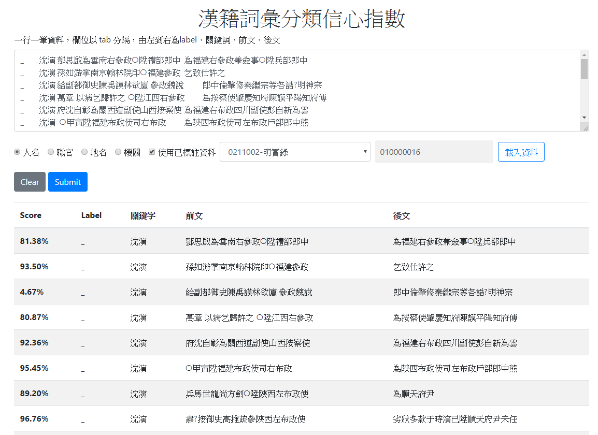

<h2>Project</h2>

* [LORE: Build Knowledge Graphs, Embeddings, and Association Predictors from Literature with LLM.](https://github.com/jacobvsdanniel/LORE) 
Peng-Hsuan Li, Yih-Yun Sun, and Jia-Hsin Huang. 2024. 
*Taiwan AI Labs*. 
 
 
 

* [pubmedKB: End-to-End Relation Extraction for Biomedical Literature.](https://github.com/jacobvsdanniel/pubmedkb_core) 
Peng-Hsuan Li, Ting-Fu Chen, and Jia-Hsin Huang. 2022. 
*Taiwan AI Labs*. 
 
 
 

* [CkipTagger: WS-POS-NER.](https://github.com/ckiplab/ckiptagger) 
Peng-Hsuan Li and Wei-Yun Ma. 2019. 
*Institute of Information Science, Academia Sinica*. 
 
 
 

* [CKIP Ancient Chinese Document NER.](https://github.com/jacobvsdanniel/ancient_chinese_NER) 
Peng-Hsuan Li and Wei-Yun Ma. 2018. 
*Institute of Information Science, Academia Sinica*. 
 
 
 

* [Classroom Population Recognition without Lens.](doc/classroom_population_recognition.pdf) 
Yao-Hua Yang, Peng-Hsuan Li, Shih-Han Wang, and Jane Yung-Jen Hsu. 2015. 
*Department of Computer Science & Information Engineering, National Taiwan University*. 
 
 
 
